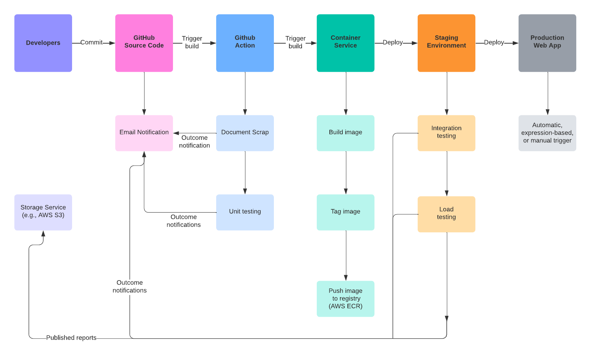

# [Improving Medical Guidelines for DukeHealth with LLMS + RAGS](http://a8ce9e3e89dba429aaa34ee8a1d555a8-1642442899.us-east-1.elb.amazonaws.com/)

A Cloud Computing Project meant to serve Duke Health's quest to optimize the process of updating current medical guidelines with the use of LLMs and RAGs. 

## :movie_camera: Demo Video
Here is our demo video for __`Improving Medical Guidelines for DukeHealth with LLMS + RAGS`__ project with Group 26 and Group 34. <br/>
🔗 [Demo Video](https://youtu.be/bFbGuXQaFjg)

## Table of Contents

1. [Team Members](#Team)
2. [Stakeholders](#Stakeholders)
3. [Motivation](#Motivation)
4. [Prior Work](#Prior)
5. [Solutions Framework](#Architecture)
6. [Setup](#Setup)

## Team Members <a name="Team"></a>

Contributors :

- [Bob Zhang](https://github.com/BobZhang26)
- [Osama Shawir](https://github.com/osama-shawir)
- [Doyinsolami Oloaye](https://github.com/doyinsolamiolaoye)
- [Eric Rios](https://github.com/EricR401S)
- [Suim Park](https://github.com/suim-park)

Faculty Mentor : [Prof. Noah Gift](http://noahgift.com/)

Teaching Assistant Mentor : [Kahlia Hogg](https://www.linkedin.com/in/kahliahogg/)

## Stakeholders <a name="Stakeholders"></a>

- [Dr. Wong](https://www.linkedin.com/in/aianwong/)

## Motivation <a name="Motivation"></a>

Dr. Ian Wong and his team have to read an extremely high amount of articles to update the care guidelines for different diseases. Each year, multiple reputable publications are published (like the ones on Pubmed), and they illustrate different treatments to various diseases. After a set amount of time, guidelines are updated, potentially on a multi-year cycle, but then the next year's findings can render many of those revised guidelines outdated. Reading all of these resources require much time and much knowledge in the medical field, which is updating rapidly. It is a game of cat and mouse. 

Rationally, one would consider using generative AI to help solve this problem. However, his concerns with using a normal LLM, besides the hallucinations (known as incorrect outputs), is using an updated and/or outdated guideline that hurts the patient (which could result in death). His other concern is patient privacy and the fact that models like ChatGPT do not provide sources when producing their responses. It is crucial for the doctor on the receiving end of a potential software solution to assess the sources producing any given guidelines. 

## Prior Work <a name="Prior"></a>

Various GPT like solutions have emerged to work with publications; however, many are available on the ChatGPT marketplace. As for our stakeholder, he requires being able to control the model and its privacy, so it's essential that any OpenAI solutions are discarded from our solutions framework.

## Usage <a name="Usage"></a>

Before jumping into the solutions framework, if you want to be able to use the applications leveraged here, you can access the link and test it out for yourself. It can be done in one of two ways.

1) Access the [link](http://a8ce9e3e89dba429aaa34ee8a1d555a8-1642442899.us-east-1.elb.amazonaws.com/). This is the public endpoint we prepared for our application. It may be deactivated in the future to reduce pricing. We will notify such deactivation in this description.

2) Skip to the [Setup](#Setup) section, as it will provide directions on all of the nuances regarding AWS permissions that you would need in order to run this project.

## Solution Framework <a name="Architecture"></a>




To give our stakeholder the greatest amount of flexibility, we chose to leverage the skills gained in our Cloud Computing coursework to build the following solutions framework, which is built upon working approaches in the fiel. There are 5 key components in this framework, where different design decisions played a role.

1) Frontend - This is a streamlit app that will instantiate both the LLMs and the RAG. Streamlit is often used in the field to demonstrate LLM applications, and it is very versatile, allowing the display of images, text and audio. The app would house the prompt boxes to allow Dr. Wong to evaluate the validity of the responses.

2) AWS Bedrock LLAMA Model - LLAMA is a large language model published by META and DeepLearning.Ai. AWS Bedrock is an Amazon Web Service (AWS) that leverages foundational models and hosts them on the cloud. By hosting them, we have effectively abstracted the storage concerns for housing gigabytes worth of models. Another aspect that was extremely important to us was Bedrock's HIPAA certification.

3) Vector Database (Knowledge Base) - We needed a vector database to facilitate Retrieval Augmented Search (RAG), as the model would need to use an accurate knowledge base with which to provide answers. RAG is a technique for enhancing the accuracy and reliability of generative models with information coming from external sources. User queries are embedded into vectors, which are compared to embeddings in the special knowledge base. This knowledge base can be a wealth of documents for finance, media, pop culture, and/or medicine. As long as it requires a knowledge base, a wealth of documents can be purposed for a RAG database (which has vectors, making it a database of vectors). In addition, one additional feature is the ability to track the sources from which these answers come. Lastly, if curious about RAG for LLMs, consult NVIDIA's excellent [resource](https://blogs.nvidia.com/blog/what-is-retrieval-augmented-generation/) on it.

4) PDF Ingestion - For purposes of the example, ease of programmatic access, and lack of access to Pubmed publications, the pdfs ingested, aside from a few medical examples, were mostly from arXiv, so many thanks to them and their S3 bucket. The pdfs are downloaded and sent to our S3 bucket, which is directly linked to the AWS knowledge base, which allows the outputs to be connected to their sources. Upon every push, the pdfs are routinely ingested into S3 and synced with the knowledge base. 

5) Deployment - Since the storage concerns of the model were abstracted, the application can be easily dockerized, with special attention to exposing the port 8501, Streamlit's default port. Upon every push, this image is then deployed to Kubernetes, where it can be easily scaled to many instances for use, if need be.

In short, a Streamlit app will run the LLM and RAG in the background and show the prompt box for the user to use. After being instantiated, the vector database will be updated if the user uploads a PDF. This app is dockerized and deployed with AWS Elastic Kubernetes Service, where it can be scaled according to user needs. Lastly, the user experiments with the prompting in order to validate accuracy. 

## Setup <a name="Setup"></a>

To run the following code, run the following commands.

### Pre-requisites : AWS Permissions

The very first step is to create a user in the IAM Control Center, located in the AWS console manager. Make sure the user has these permissions. These will be required to access AWS Bedrock, AWS Knowledge Base, and AWS EKS. You will need these regardless, whether you want to run this locally for trying the application or because you are a developer.

### environment setup
- 1. Create a virtual environment!!! **THIS IS VERY IMPORTANT**. This will help you to keep your dependencies in a separate environment and not mess up with your system dependencies. And `Dockerizing the application will be easier`.
```bash
python3 -m venv venv
```
- 2. Activate the virtual environment
```bash
source venv/bin/activate
```
- 3. Install the requirements using Makefile
```bash
make install
```

### Credentials Setup
- 1. Make sure you have the `aws credentials` in your system. If not, create one using the following command
```bash
aws configure
```
In the AWS configuration file, you will have to provide the following details:
```bash
AWS Access Key ID [None]: YOUR_ACCESS_KEY
AWS Secret Access Key [None]: YOUR_SECRET_KEY
Default region name [None]: us-east-1
Default output format [None]: json
```
### IAMs setup


### End User (Non-Development Purposes) Guide

First, [install awscli](https://docs.aws.amazon.com/cli/latest/userguide/getting-started-install.html) in your local environment. Configure your credentials that you made, which house the permissions that you attached, in your local environment with `aws configure`. 

```
# running locally
pip install -r requirements.txt
streamlit run app.py

# running locally with docker
make run-local-docker
```

Play with the streamlit app locally by opening the following localhost link in your browser : .

### Developer User

Here are the main pieces to setup.

1) The AWS Bedrock Setup

2) Dockerization

3) The AWS Knowledge Base Setup

4) The Kubernetes Deployment

### AWS Bedrock Setup  
- 1. Login to the AWS console and go to the bedrock
- 2. click get started
- 3. On the left side, navigate to model access
- 4. Click orange botton 'manage model access'
- 5. Check box `Titan Embeddings G1 - Text` and `Titan Text G1 - Express`
- 6. Scroll down to click `request model access`
- 7. Wait for the approval. It should be immediate. 

### [Dockerizing the application](https://github.com/nogibjj/Health-LLM-Using-Bedrock/tree/main/docker%2Bdeployment)
**MAKE SURE YOUR DOCKER IS INSTALLED IN YOUR SYSTEM AND ACTIVATED**
- 1. Build the docker image
```bash
docker build -t health-llm:001 .
```
The image has name `health-llm` and tag `001`. You can change the name and tag as per your requirement. This image will be stored in your DockerHub

- 2. Run the docker image
```bash
docker run -p 8501:8501 health-llm:001
```
This will run the docker image in the port `8501`. You can change the port as per your requirement. The first port is the port in your system (in this case I ran on github codespace the default port is `8501` but if you run on local machine, it should be `8000`) and the second port is the port in the docker image. You can define the port in the `Dockerfile` as well. See `EXPOSE 8501` in the `Dockerfile`

### The AWS Knowledge Base Setup  

This project implements a contextual chatbot application built on Amazon Bedrock Knowledge Bases using Retrieval-Augmented Generation (RAG).

#### Technical Specifications:

* Knowledge Base Name: knowledgebase-</your-awsaccount-number/>
* Embedding Model: Titan Embedding G1 – Text.
* Foundation Model: Anthropic Claude
* Vector Database: Amazon Opensearch Severless vector
* AWS Cloud Formation to deploy lambda function for retrival

#### Project Dependencies:

Refer to a requirements.txt file (or equivalent) outlining all necessary libraries and their versions.

#### Prerequisites:

* An AWS account with access to Amazon Bedrock services.
* Local development environment with Python and access to AWS CLI.
* Data Preparation:
    Organize your chatbot's knowledge base content (documents, FAQs) by uploading the documents in a AWS S3 bucket.
    Ensure data format compatibility with Amazon Bedrock (e.g., text files, pdfs).

#### Knowledge Base Creation:

* Create bucket.
* Name the bucket knowledgebase-</your-awsaccount-number/>.
* Choose Create folder and name it dataset, upload documents here.
* Specify the data source location containing your knowledge base content 
* For Embeddings model, select Titan Embedding G1 – Text.
* For Vector database, you can either select Quick create a new vector store or Choose a vector store you have created and then sync.

#### Lambda function Creation:

* Create folder in the originally created s3 bucket and name it lambdalayer.
* Upload the knowledgebase-lambdalayer.zip file available under the /lambda/layer folder in this repo and upload.
* On the AWS CloudFormation service home page, create a stack.
* Upload the .yaml file under the cfn folder as a template file to create the stack
* Choose the appropriate knowledge ID from your created knowledge base and also the LambdaLayers3bucket name where the lambda layer code was uploaded earlier.
* SUbmit and Verify that the CloudFormation template ran successfully.

#### Test function Locally

* Clone the repository
* Create environment and pip install requirements.txt file
* Navigate to the /streamlit folder.
* Run the following command to instantiate the chatbot application:
```
python -m streamlit run chatbot.py
```

### The Kubernetes Deployment
Deploying applications with Kubernetes involves creating YAML configuration files that describe the desired state of your application and then applying these configurations to your Kubernetes cluster. With AWS EKS (Elastic Kubernetes Service) involves similar steps to deploying with Kubernetes in general, but with some AWS-specific considerations. 

- 1. **Create docker image and push to AWS ECR**
```bash
aws ecr get-login-password --region <region> | docker login --username AWS --password-stdin <aws_account_id>.dkr.ecr.<region>.amazonaws.com
```
```bash
docker tag <local_image_name>:
```
```bash
docker tag <image_tag> <aws_account_id>.dkr.ecr.<region>.amazonaws.com/<repository_name>:
```

- 2. **Set Up Amazon EKS Cluster**: 
Create an Amazon EKS cluster using the AWS Management Console, AWS CLI, or infrastructure-as-code tools like Terraform. Make sure the cluster has the necessary permissions to pull images from your container registry.


Also, create node for computational resources:


- 3. **Apply Deployment Manifests**: 
Use the `kubectl apply -f <manifest-file>` command to apply your Deployment and Service manifests to your Amazon EKS cluster.


- 4. **Deployed [Web App](http://a8ce9e3e89dba429aaa34ee8a1d555a8-1642442899.us-east-1.elb.amazonaws.com/)**:


For more information, please navigate to directory [`docker+deployment`](https://github.com/nogibjj/Health-LLM-Using-Bedrock/tree/main/docker%2Bdeployment).

## Licenses

Creative Commons.

## Project Status and Monitoring

It is completed as of April, 2024. Implementing monitoring and metrics collection for a service is crucial for evaluating the system's health and performance. By implementing monitoring and metrics collection for your service, you can gain valuable insights into its behavior, identify potential issues proactively, and ensure optimal performance and reliability.


## Next Steps

1) Build a Medical PDF Ingestion Pipeline - the main challenge with this step is that [PubMed](https://pubmed.ncbi.nlm.nih.gov/), the main resource for medical journals and publications, has various sources for its publications. Some are hosted directly on the website, while some others are hosted on different journals and sites, all with different formats. In this latter case, some are web pages, while others are pdfs. One initial and reasonably complex hurdle is that some are available with special credentials. As for Pubmed's [API](https://www.ncbi.nlm.nih.gov/books/NBK25497/), EZ-Programming Utilities is notoriously complex, and other great programmers have developed tools to work with it, as much as possible. If you want to delve more into this topic, the great [Illia Zenkov](https://github.com/IliaZenkov) has produced a [special asynchronous scraper](https://github.com/IliaZenkov), which gets Pubmed links depending on the provided keywords. However, that is precisely the limitation: links, not PDFs. Here is [in-depth documentation](https://github.com/nogibjj/Health-LLM-Using-Bedrock/blob/main/documentation/PDFIngestion/README.md) demonstrating the challenges with Pubmed. 
