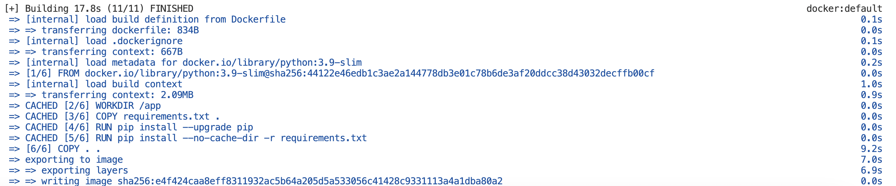
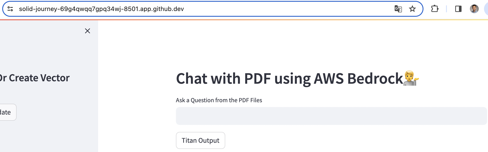
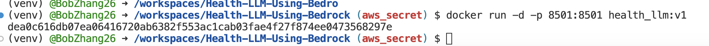
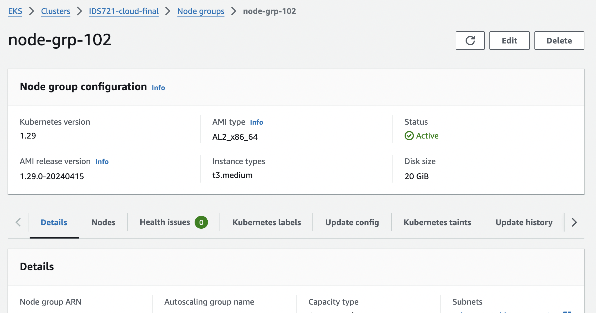
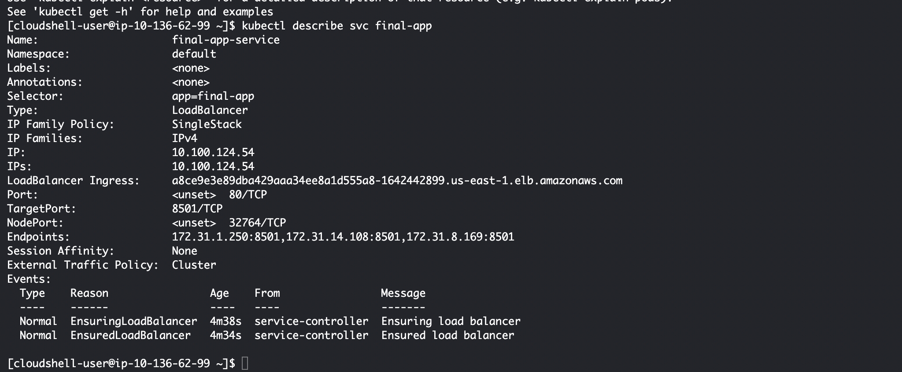

# Health-LLM-Using-Bedrock

# Environment Setup
- 1. Create a virtual environment!!! **THIS IS VERY IMPORTANT**. This will help you to keep your dependencies in a separate environment and not mess up with your system dependencies. And `Dockerizing the application will be easier`.
```bash
python3 -m venv venv
```
- 2. Activate the virtual environment
```bash
source venv/bin/activate
```
- 3. Install the requirements using Makefile
```bash
make install
```

## Credentials Setup
- 1. Make sure you have the `aws credentials` in your system. If not, create one using the following command
```bash
aws configure
```
In the AWS configuration file, you will have to provide the following details:
```bash
AWS Access Key ID [None]: YOUR_ACCESS_KEY
AWS Secret Access Key [None]: YOUR_SECRET_KEY
Default region name [None]: us-east-1
Default output format [None]: json
```

## model access setup
- 1. Login to the AWS console and go to the bedrock
- 2. click get started
- 3. On the left side, navigate to model access
- 4. Click orange botton 'manage model access'
- 5. Check box `Titan Embeddings G1 - Text` and `Titan Text G1 - Express`
- 6. Scroll down to click `request model access`
- 7. Wait for the approval. It should be immediate. 

## IAMs setup


# Dockerizing the application
Dockerization can be split into 3 stages: Dockerfile, image and containerization. The Dockerfile contains the necessary instructions that needed to create a Docker image. A Dockerfile is a text document that contains a set of instructions for building a Docker image. These instructions define the steps needed to create a reproducible and portable containerized environment.

### Dockerfile
The main functions of a Dockerfile include:

1. **Defining the Base Image**: The Dockerfile starts by specifying the base image upon which the new image will be built. This base image typically contains a minimal operating system environment, such as Alpine Linux or Ubuntu, and may include additional software or libraries required for the application.

2. **Adding Dependencies and Application Code**: The Dockerfile includes instructions to copy files and directories from the host machine into the image. This allows you to add dependencies, configuration files, and application code to the image.

3. **Running Commands**: The Dockerfile can execute commands within the image to perform tasks such as installing packages, configuring services, and setting environment variables.

4. **Exposing Ports**: If the containerized application needs to accept network connections, the Dockerfile can specify which ports should be exposed from the container to the host system.

5. **Defining Entrypoint and Command**: The Dockerfile can specify the default command to run when the container starts, as well as any arguments or options for that command. This defines the primary process for the container.

6. **Documenting the Build Process**: A well-written Dockerfile serves as documentation for the build process, making it easy for developers to understand how the image is constructed and what dependencies are required.

Overall, the Dockerfile is a fundamental component of Docker-based development and deployment workflows. It allows developers to define the environment and configuration of their applications in a concise and repeatable way, enabling consistent and reliable deployment across different environments. 

Here we present the example of our Dockerfile
```Dockerfile
# Use an existing Docker image with Python as the base image
FROM python:3.9-slim

# Set the working directory in the container
WORKDIR /app

# Copy the requirements.txt file into the container at /app
COPY requirements.txt .

RUN pip install --upgrade pip

# Install any dependencies specified in requirements.txt
RUN pip install --no-cache-dir -r requirements.txt

# Copy the entire current directory into the container at /app
COPY . .

# Expose port 8501 to the outside world. This is the port Streamlit runs on the container
EXPOSE 8501

# Command to run the Streamlit app
CMD ["streamlit", "run", "app.py"]

```
### Creating docker image
**MAKE SURE YOUR DOCKER IS INSTALLED IN THE SYSTEM AND ACTIVATED**
- Build the docker image
```bash
docker build -t health-llm:001 .
```
The image has name `health-llm` and tag `001`. You can change the name and tag as per your requirement. This image will be stored in your DockerHub


### Containerization test 
- Run the docker image
```bash
docker run -p 8501:8501 health-llm:001
```

This will run the docker image in the port `8501`. You can change the port as per your requirement. The first port is the port in your system (in this case I ran on github codespace the default port is `8501` but if you run on local machine, it should be `8000`) and the second port is the port in the docker image. You can define the port in the `Dockerfile` as well. See `EXPOSE 8501` in the `Dockerfile`


# Deployment with Kubernetes
Deploying applications with Kubernetes involves creating YAML configuration files that describe the desired state of your application and then applying these configurations to your Kubernetes cluster. With AWS EKS (Elastic Kubernetes Service) involves similar steps to deploying with Kubernetes in general, but with some AWS-specific considerations. Here's a general outline of the steps involved in deploying an application with Amazon EKS:

1. **Containerize Your Application**: Dockerize your application by creating a Dockerfile that specifies how to build your application into a container image.


2. **Push Container Image to Container Registry**: Push your Docker image to a container registry that Amazon EKS can access. You can use Amazon ECR (Elastic Container Registry) or any other compatible container registry.
```bash
aws ecr get-login-password --region <region> | docker login --username AWS --password-stdin <aws_account_id>.dkr.ecr.<region>.amazonaws.com
```
```bash
docker tag <local_image_name>:
```
```bash
docker tag <image_tag> <aws_account_id>.dkr.ecr.<region>.amazonaws.com/<repository_name>:
```

3. **Write Kubernetes Deployment Manifests**: Create Kubernetes Deployment and Service manifests (YAML files) that define the desired state of your application deployment.

- Deployment: Describes how many instances (pods) of your application should run, what container image to use, and how to handle updates and rollbacks.
```yaml
    apiVersion: apps/v1
kind: Deployment
metadata:
  name: final-app-deployment
  labels:
    app: final-app
spec:
  replicas: 3
  selector:
    matchLabels:
      app: final-app
  template:
    metadata:
      labels:
        app: final-app
    spec:
      containers:
      - name: final-app
        image: 558851538947.dkr.ecr.us-east-1.amazonaws.com/health_llm:latest
        ports:
        - containerPort: 8501
        env:
        - name: AWS_ACCESS_KEY_ID
          value: "your-value"
        - name: AWS_SECRET_ACCESS_KEY
          value: "your-value"
        - name: AWS_DEFAULT_REGION
          value: "your-region"
        resources:
          requests:
            memory: "128Mi"
            cpu: "100m"
          limits:
            memory: "256Mi"
            cpu: "500m"
```
- Service: Defines how clients can access your application. This can include load balancing, port forwarding, and service discovery.
```yaml
apiVersion: v1
kind: Service
metadata:
  name: final-app-service
spec:
  type: LoadBalancer
  ports:
  - port: 80
    targetPort: 8501
    protocol: TCP
  selector:
    app: final-app
```

4. **Set Up Amazon EKS Cluster**: Create an Amazon EKS cluster using the AWS Management Console, AWS CLI, or infrastructure-as-code tools like Terraform. Make sure the cluster has the necessary permissions to pull images from your container registry.


Also, create node for computational resources:



5. **Configure `kubectl`**: Configure your `kubectl` command-line tool to communicate with your Amazon EKS cluster. You can do this using the `aws eks update-kubeconfig` command.

6. **Apply Deployment Manifests**: Use the `kubectl apply -f <manifest-file>` command to apply your Deployment and Service manifests to your Amazon EKS cluster.


7. **Deployed Web App**:


By following these steps, you can deploy and manage your applications effectively with Amazon EKS. Be sure to familiarize yourself with AWS-specific features and best practices for managing Kubernetes clusters on AWS.