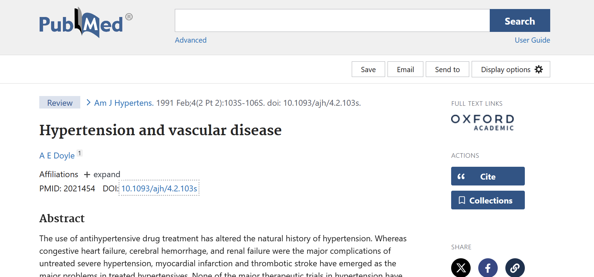
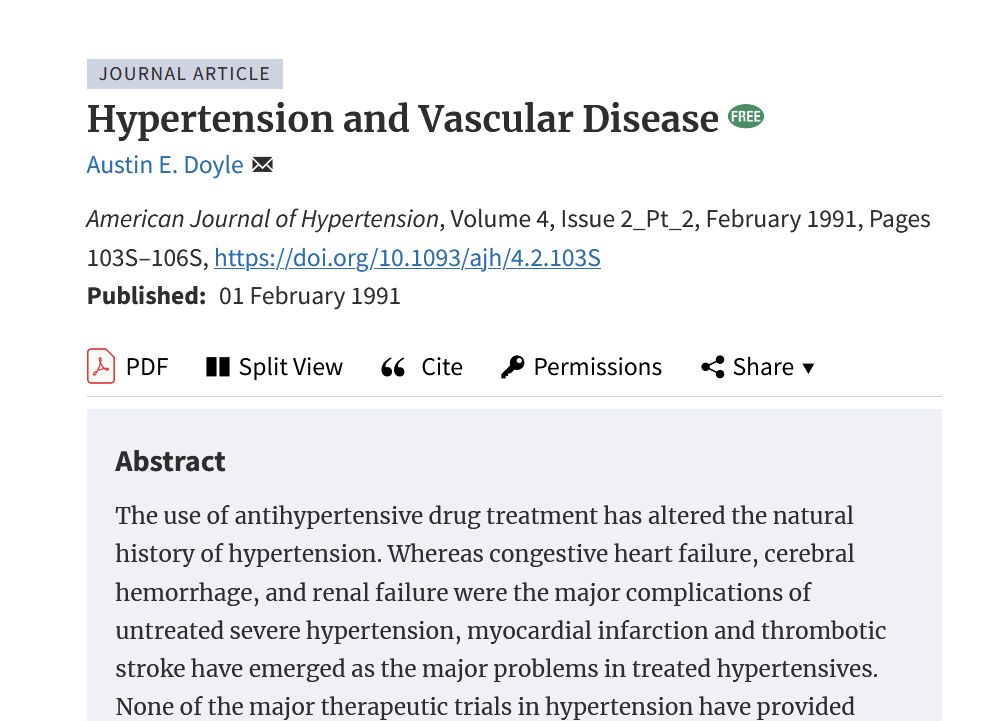
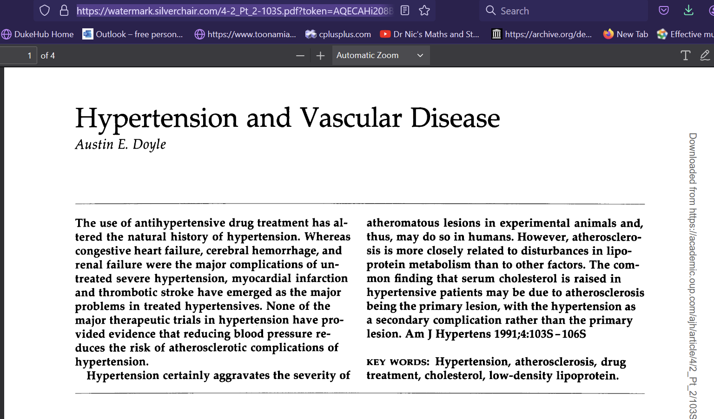
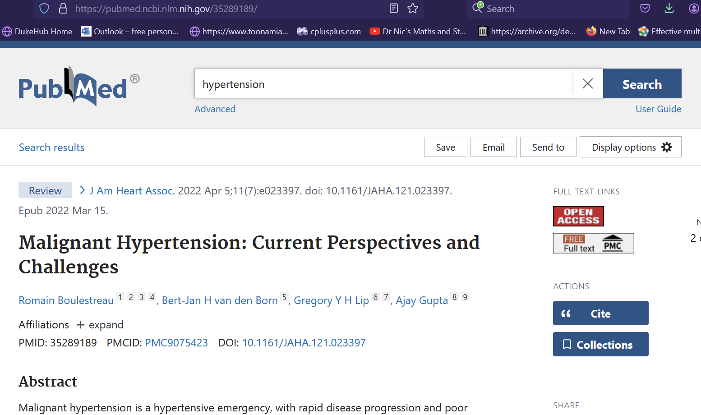
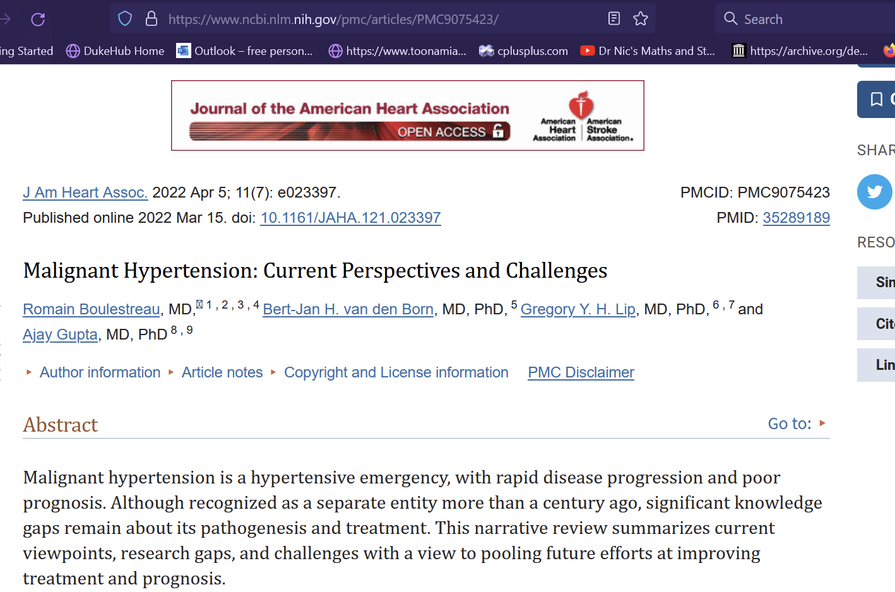
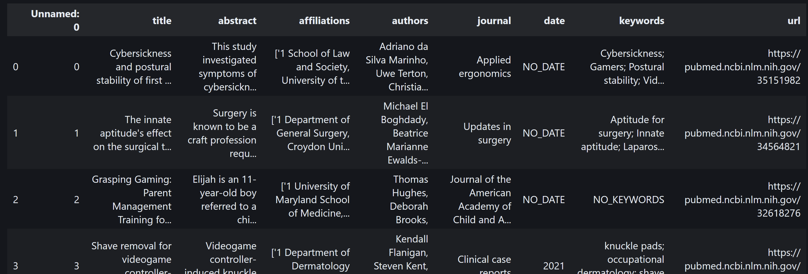

# Challenges with PDF Ingestion from PUBMED

## Examples of Challenging Scraping

Here is a [link](https://pubmed.ncbi.nlm.nih.gov/2021454/) to a publication about hypertension. This paper has a DOI link and a publication journal link (in this case Oxford), like all the others. 

Either link leads to a page with an abstract and a link to a pdf.

Carefully observe the link of that pdf.

With these observations in mind, let us observe [another](https://pubmed.ncbi.nlm.nih.gov/35289189/) publication. This time, we will look at malignant hypertension

Observe the PPMCID and DOI links, as well as the OPEN ACCESS and PMC FULL TEXT links. After clicking on them, they all lead to full variants of the publication.

Just by observing the links on both pages, one can appreciate the sizable difficulty of building a scraping script that can do the following:

1) Obtain the publication's id.

2) Extract the types of links in the PubMed publication urls.

3) Try to scrape combinations of these links and the publication ids.

4) Find a way to accommodate the credential systems required to even access the full text of these publications.

## Final Note : Hope

[Illia Zenkov](https://github.com/IliaZenkov) has done excellent work in producing an asynchronous scraper that is able to scrape quickly. However, the drawback is that one needs to input keywords to obtain article links related to these keywords. Secondly, all one gets is a dataframe of records corresponding to articles, where one of the columns is a link (and that is without addressing the occassional missing values). Here is an image of a scrape I completed with the following keywords : video games and diabetes.

At least, the publication ids for step 1 are accessible. Steps 2 through 4 are still the final hill to climb in order to build a medical corpus fit for updating a retrieval augmented knowledge base. 
